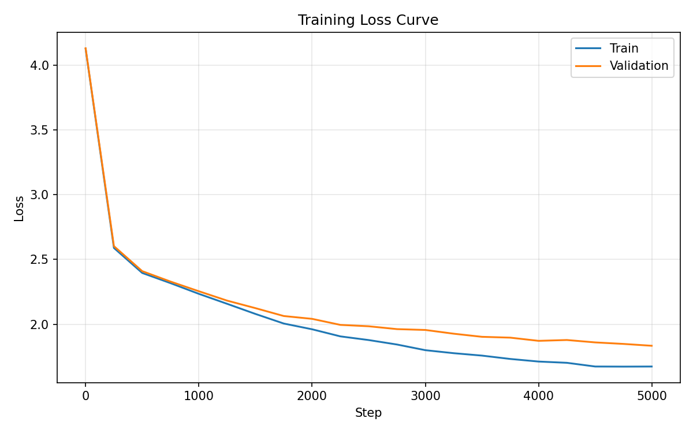
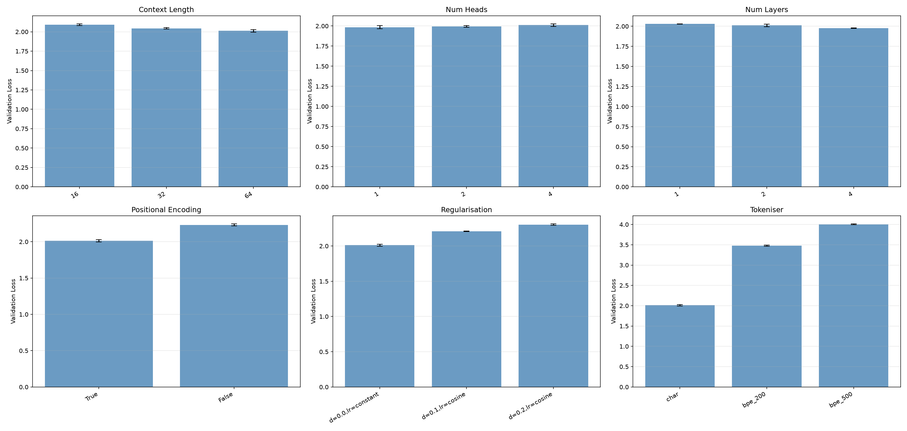
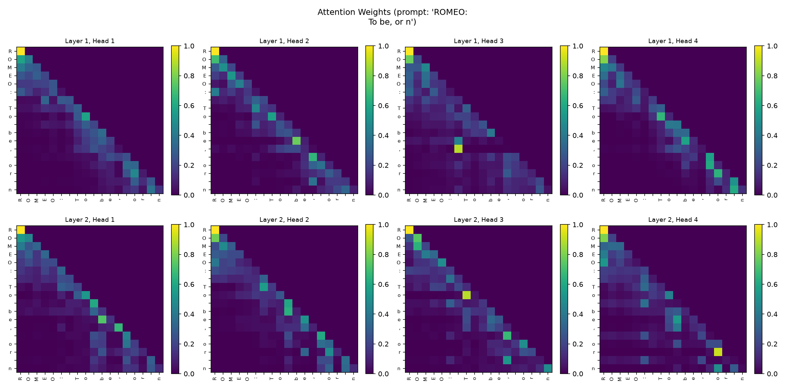
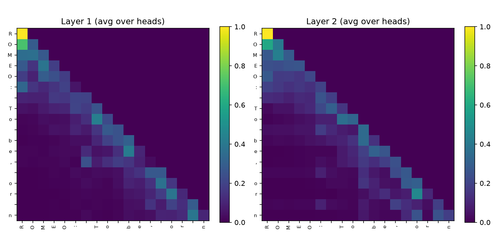

# Tiny Transformer from Scratch

[](https://github.com/zyx100089-eng/tiny-transformer/actions/workflows/tests.yml)
[](https://www.python.org)
[](LICENSE)

A small Transformer language model implemented from first principles in PyTorch, trained on character-level Shakespeare text, with ablation experiments investigating architectural design choices.

## Results

### Training loss curve



### Ablation study (3 seeds, mean ± std)



### Attention weight heatmaps





### Generated text samples

```
BRUTUS:
My stall prace me my come, what I wall?
And him that is but cracial, and it the a the hath
Thou god Parcureds
Beautiof a gates all here.

SICINIUS:
By strun'd, to the light, to the long slie.

MAUMNIUS:
He as have you in honour's foot,
That what and should this roighter home a thy bone
Which and the to will frown in than thy laone.
```

*(See `results/generated_samples.txt` for full samples — the CAPS: dialogue format and verse structure are captured, though character names come out garbled (e.g. "QUEEN MVIUS:") at this model size.)*

## Research Question

How do context length, number of attention heads, positional encoding, regularisation, and tokenisation strategy affect the performance of a small Transformer language model?

**A note on "from scratch":** the architecture (attention, blocks,
training loop, BPE) is written from first principles in PyTorch —
PyTorch provides the tensor ops and autograd, which my other projects
(autodiff engine, CNN) deliberately avoid. I used it here because the
ablations needed to run at speed, and I wanted to see whether my
from-scratch understanding survived in a fast framework. It did — the
model is the same one I'd hand-written elsewhere, with better
numerics.

## What This Implements

- **Character-level tokenizer** (encode/decode) with save/load
- **Byte-pair encoding (BPE) tokenizer** implemented from scratch with greedy merge learning
- Token and positional embeddings with optional dropout
- Scaled dot-product self-attention with causal masking
- Multi-head attention with per-head dropout
- Feed-forward network with GELU activation and dropout
- Transformer blocks with pre-norm residual connections
- Cosine learning rate schedule with warmup
- Autoregressive text generation with temperature sampling
- Attention weight visualisation (per-head and per-layer heatmaps)
- Multi-seed ablation experiments reporting mean ± std

## Setup

```bash
python3 -m venv .venv
source .venv/bin/activate
pip install -r requirements.txt
```

Download training data (Tiny Shakespeare):

```bash
mkdir -p data
curl -sL "https://raw.githubusercontent.com/karpathy/char-rnn/master/data/tinyshakespeare/input.txt" -o data/input.txt
```

## Usage

Train the model:

```bash
# Default (no regularisation)
python train.py

# With dropout and cosine LR schedule
python train.py --dropout 0.1 --lr_schedule cosine
```

Generate text:

```bash
python generate.py --prompt "ROMEO:" --temperature 0.8
```

Visualise attention weights:

```bash
python visualize.py --prompt "ROMEO:\nTo be, or n"
```

Run ablation experiments (multi-seed, includes regularisation and tokeniser comparisons):

```bash
python experiments.py
# Or with custom seeds / iterations:
python experiments.py --seeds 42 123 777 --max_iters 2000
```

Run tests:

```bash
python -m pytest tests/ -v
```

## Default Hyperparameters

| Parameter | Value |
|---|---|
| Embedding dimension | 64 |
| Attention heads | 4 |
| Transformer layers | 2 |
| Context length | 64 |
| Batch size | 32 |
| Learning rate | 3e-4 |
| Training iterations | 5000 |
| Dropout | 0.0 (configurable) |
| LR schedule | constant (or cosine with warmup) |

## Ablation Experiments

All experiments run across 3 random seeds and report mean ± standard deviation:

| Experiment | Variants |
|---|---|
| Baseline | bigram (0 parameters, exact validation loss) |
| Context length | 16 vs 32 vs 64 |
| Attention heads | 1 vs 2 vs 4 |
| Number of layers | 1 vs 2 vs 4 |
| Positional encoding | with vs without |
| Regularisation | none vs dropout=0.1+cosine vs dropout=0.2+cosine |
| Tokeniser | character vs BPE(200) vs BPE(500) |

The **bigram baseline** (`bigram.py`) is the standard reference point
for "did the model learn anything": it counts P(next | current) on
the training split and evaluates the exact cross-entropy on
validation — no parameters, no training. On Tiny Shakespeare the
bigram validation loss is **2.51**, while the default transformer
reaches **~2.04** — the model genuinely learns beyond token
co-occurrence statistics, and every ablation variant can be read
against that floor.

Results are saved to `results/ablation_results.csv` and `results/ablation_plots.png`.
Attention heatmaps are saved to `results/attention/`.

## Project Structure

```
├── model.py           # Transformer architecture (attention, blocks, full model)
├── tokenizer.py       # Character-level tokenizer
├── bpe_tokenizer.py   # Byte-pair encoding tokenizer (from scratch)
├── bigram.py          # Bigram baseline (0-parameter reference point)
├── dataset.py         # Text loading, batch creation, tokenizer selection
├── train.py           # Training loop with cosine LR schedule, loss logging
├── generate.py        # Autoregressive text generation
├── experiments.py     # Multi-seed ablation experiments
├── visualize.py       # Attention weight visualisation (heatmaps)
├── tests/             # Unit tests (attention, tokenizer, model, dropout, BPE)
└── results/           # Loss curves, generated samples, ablation results, attention plots
```

## Limitations

- Small model (~112K parameters) — not comparable to production LLMs
- Single small dataset (1MB Shakespeare)
- BPE implementation does not pre-tokenise on whitespace
- No comparison with RNN/LSTM baselines (the bigram baseline covers
  the "did it learn anything" question; an LSTM comparison is a
  natural extension)

## References

- Vaswani et al., "Attention Is All You Need", 2017
- Karpathy, nanoGPT and minGPT implementations
- Ba et al., "Layer Normalization", 2016